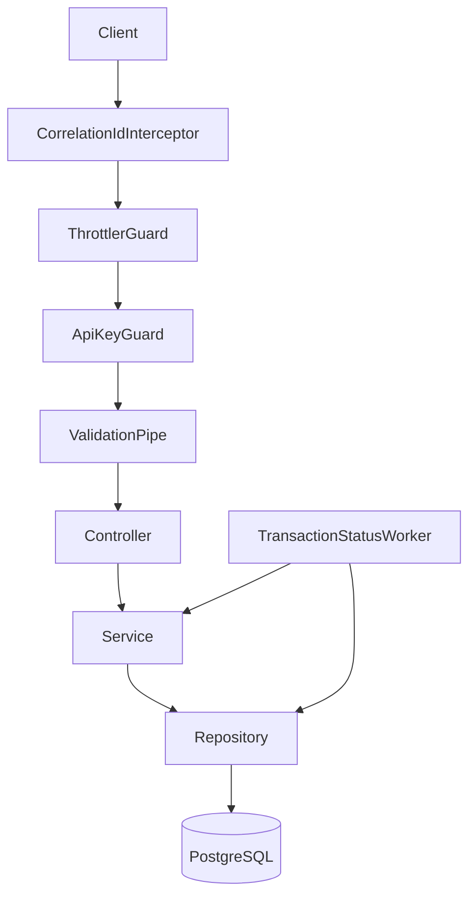

# Crypto Wallet API - Bitoshi

Node.js API built with NestJS (Express) and PostgreSQL for wallet transaction processing. The application is modular by domain (`wallet`, `transaction`) with a shared `common` layer for reusable infrastructure.

## Tech Stack

- NestJS + Express
- TypeORM + PostgreSQL
- class-validator / class-transformer
- decimal.js for safe amount arithmetic
- @nestjs/schedule (mocked status worker)
- @nestjs/throttler + API key guard
- pnpm

## Architecture



### Request Flow

1. Request enters Nest app and gets a correlation ID (`x-correlation-id`).
2. Rate limiting and API key guard are applied globally.
3. DTO validation and transformation occur via global validation pipe.
4. Controller delegates to service layer.
5. Service performs business rules and orchestrates repository/database operations.
6. Errors are normalized by the global exception filter.

## Project Structure

```txt
.
├── src/
│   ├── app.module.ts
│   ├── main.ts
│   ├── common/
│   │   ├── config/
│   │   ├── database/
│   │   ├── dto/
│   │   ├── filters/
│   │   ├── guards/
│   │   ├── interceptors/
│   │   └── utils/
│   ├── domain/
│   │   ├── wallet/
│   │   └── transaction/
│   └── database/
│       ├── migrations/
│       └── seeds/
├── test/
└── ormconfig.ts
```

## Database Schema

### `wallets`

Single-asset wallets (one wallet = one asset).

| Column | Type | Notes |
| --- | --- | --- |
| `id` | `uuid` PK | generated via `gen_random_uuid()` |
| `owner_id` | `varchar(255)` | wallet owner identifier |
| `asset` | enum (`BTC`, `ETH`, `USDT`) | wallet asset |
| `available_balance` | `numeric(36,18)` | spendable balance |
| `locked_balance` | `numeric(36,18)` | reserved balance for pending txs |
| `created_at` | `timestamptz` | auto |
| `updated_at` | `timestamptz` | auto |

### `transactions`

| Column | Type | Notes |
| --- | --- | --- |
| `id` | `uuid` PK | generated via `gen_random_uuid()` |
| `wallet_id` | `uuid` FK | references `wallets.id` |
| `type` | enum | `deposit`, `withdrawal`, `transfer` |
| `asset` | enum | `BTC`, `ETH`, `USDT` |
| `amount` | `numeric(36,18)` | exposed as string in API |
| `to_address` | `varchar(255)` nullable | destination address |
| `network` | enum | `Bitcoin`, `Ethereum` |
| `status` | enum | `pending`, `confirmed`, `failed` |
| `tx_hash` | `varchar(255)` nullable | mocked hash |
| `idempotency_key` | `varchar(255)` nullable | request idempotency |
| `created_at` | `timestamptz` | auto |
| `updated_at` | `timestamptz` | auto |

Indexes:
- `transactions_wallet_id_created_at_idx` on (`wallet_id`, `created_at`)
- `transactions_wallet_type_idempotency_key_uidx` UNIQUE on (`wallet_id`, `type`, `idempotency_key`) where `idempotency_key IS NOT NULL`

## Key Design Decisions

- **Safe amounts**: balances and transaction amounts are stored as `numeric(36,18)` and computed with `decimal.js` in `AmountUtil`.
- **Idempotency**: deposits and withdrawals require `Idempotency-Key`; duplicates are resolved via scoped uniqueness (`wallet_id + type + idempotency_key`) + replay lookup.
- **Consistency**: withdrawals run inside one DB transaction and use atomic conditional SQL balance movement (`available_balance >= amount`) to prevent overdraw under concurrency.
- **Pagination**: transaction listing uses cursor-based pagination with base64 payload of `{ createdAt, id }`.
- **Async status updates**: `TransactionStatusWorker` runs every 30 seconds, resolves old pending withdrawals, and reconciles balances.

## Environment

Copy `.env.example` to `.env`:

```bash
cp .env.example .env
```

Required values:

- `NODE_ENV`
- `PORT`
- `API_PREFIX`
- `API_KEY`
- `DATABASE_HOST`
- `DATABASE_PORT`
- `DATABASE_USER`
- `DATABASE_PASSWORD`
- `DATABASE_NAME`
- `DATABASE_SSL`
- `OTEL_SERVICE_NAME`
- `OTEL_EXPORTER_OTLP_ENDPOINT`
- `OTEL_EXPORTER_OTLP_PROTOCOL`

## Install and Run

```bash
pnpm install
pnpm run build
pnpm run start:dev
```

Default base URL: `http://localhost:3000/api/v1`

## OpenTelemetry

The API initializes OpenTelemetry on startup and exports traces via OTLP.

Default local collector values in `.env.example`:

- `OTEL_EXPORTER_OTLP_ENDPOINT=http://localhost:4318`
- `OTEL_EXPORTER_OTLP_PROTOCOL=http/protobuf`

To use gRPC:

- `OTEL_EXPORTER_OTLP_PROTOCOL=grpc`
- Set `OTEL_EXPORTER_OTLP_ENDPOINT` to your gRPC collector endpoint.

To disable SDK export temporarily (for local dev without collector):

- `OTEL_SDK_DISABLED=true`

## Metrics (Prometheus)

The API exposes Prometheus-compatible metrics at:

- `GET /metrics`

This endpoint returns Prometheus text exposition format and is intended for scraping by Prometheus (or compatible backends).

### How metrics are implemented

Metrics are implemented with `prom-client` using a dedicated registry in `MetricsService`.

- **Default runtime metrics** are enabled via `collectDefaultMetrics(...)` (process/memory/event-loop, etc.).
- **Custom business counters** are registered in the same registry:
  - `bitoshi_deposits_created_total`
  - `bitoshi_withdrawals_created_total`
  - `bitoshi_transaction_transitions_total{status="confirmed|failed"}`
  - `bitoshi_application_errors_total{error_type="..."}`

### How custom metrics are updated

- `incrementDepositsCreated()` when a deposit is successfully created.
- `incrementWithdrawalsCreated()` when a withdrawal is successfully created.
- `incrementTransitionConfirmed()` and `incrementTransitionFailed()` in transaction status processing.
- `incrementError(errorType)` on request, service, and worker failures.

### Scraping with Prometheus

Example scrape config:

```yaml
scrape_configs:
  - job_name: bitoshi-api
    metrics_path: /api/v1/metrics
    static_configs:
      - targets: ["localhost:3000"]
```

If your app uses a different API prefix, update `metrics_path` accordingly.

### Example queries (PromQL)

- **Total withdrawals created**
  - `sum(bitoshi_withdrawals_created_total)`
- **Total deposits created**
  - `sum(bitoshi_deposits_created_total)`
- **Confirmed transition rate (5m)**
  - `rate(bitoshi_transaction_transitions_total{status="confirmed"}[5m])`
- **Failed transition rate (5m)**
  - `rate(bitoshi_transaction_transitions_total{status="failed"}[5m])`
- **Top error types (5m)**
  - `topk(5, sum by (error_type) (rate(bitoshi_application_errors_total[5m])))`

### Operational notes

- Keep `/metrics` internal (VPC/private ingress or auth proxy).
- Avoid exposing high-cardinality labels (for example wallet IDs and transaction IDs) in metrics.
- Use metrics for trends and alerts; use logs and traces for detailed debugging.

## Database Setup

```bash
pnpm run migration:run
pnpm run seed
```

Seeded wallet IDs (one wallet per asset):

- `11111111-1111-1111-1111-111111111111` (BTC)
- `22222222-2222-2222-2222-222222222222` (ETH)
- `33333333-3333-3333-3333-333333333333` (USDT)

## Authentication and Headers

All endpoints require:

- `x-api-key: <API_KEY>`

Deposit and withdrawal endpoints also require:

- `Idempotency-Key: <unique-client-key>`

## API Endpoints

### `GET /health`

Health check endpoint.

### `GET /wallets/:walletId`

Returns wallet metadata and balances for a single-asset wallet.

### `GET /wallets/:walletId/transactions`

Lists transactions with optional filters and cursor pagination.

Query params:

- `asset`: `BTC | ETH | USDT`
- `status`: `pending | confirmed | failed`
- `cursor`: base64 cursor
- `limit`: `1-100` (default `20`)

### `POST /wallets/:walletId/withdrawals`

Creates a withdrawal in `pending` state.

Request body:

```json
{
  "asset": "BTC",
  "amount": "0.01",
  "toAddress": "bc1q..."
}
```

Behavior:

- validates wallet existence and wallet asset compatibility
- validates available balance
- performs atomic guarded balance movement (`available_balance >= amount`) in one DB transaction
- writes transaction as `pending`
- supports idempotent replay (`200`) and fresh create (`201`)

### `POST /wallets/:walletId/deposits`

Funds a wallet immediately as a confirmed deposit.

Request body:

```json
{
  "asset": "BTC",
  "amount": "0.01"
}
```

Behavior:

- validates wallet existence and wallet asset compatibility
- increments `available_balance` atomically in a DB transaction
- writes transaction as `confirmed` with `confirmedAt`
- supports idempotent replay (`200`) and fresh create (`201`)

## Background Worker

`TransactionStatusWorker` runs every 30 seconds:

- selects pending transactions older than one minute
- marks `confirmed` (80%) or `failed` (20%)
- adjusts wallet `locked_balance` and `available_balance`

## Testing and Quality

```bash
pnpm run lint
pnpm run test
pnpm run test:e2e
```

E2E coverage in `test/transaction/create-withdrawal.e2e-spec.ts`:

- happy path (`201`)
- idempotent replay (`200`)
- insufficient balance (`422`)

Additional unit coverage:
- `src/domain/transaction/services/transaction.service.spec.ts` (idempotency conflict/replay handling)
- `src/domain/transaction/workers/transaction-status.worker.spec.ts` (transition compare-and-set conflict handling)
